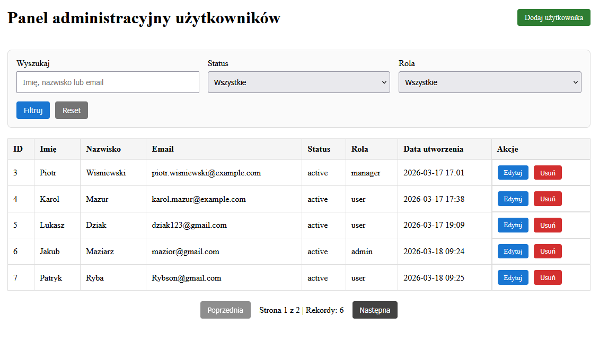
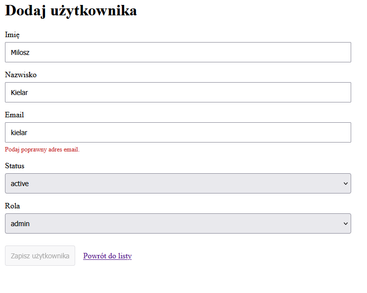
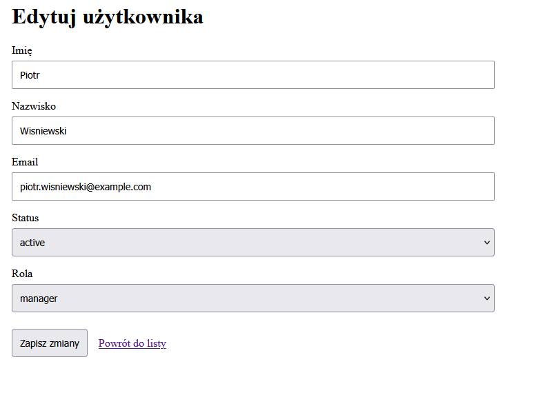
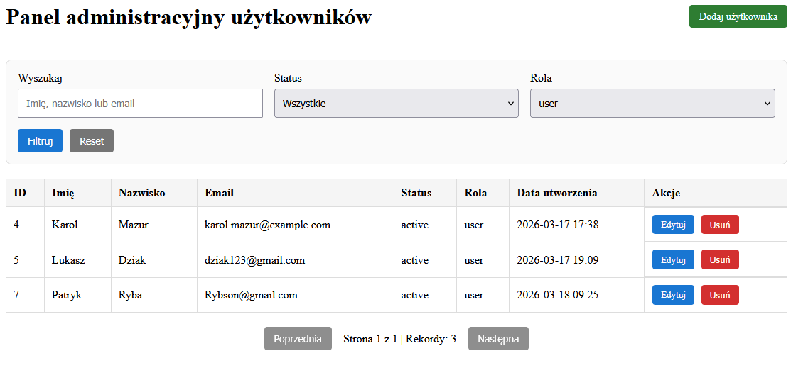

# Panel administracyjny użytkowników

Projekt portfolio Full Stack (Python + Angular) przedstawiający system zarządzania użytkownikami.

---

## Opis projektu

Aplikacja umożliwia administratorowi:

- przeglądanie listy użytkowników
- dodawanie użytkowników
- edycję danych użytkownika
- usuwanie użytkownika
- filtrowanie i wyszukiwanie
- przypisywanie ról
- paginację wyników

---

## Technologie

### Backend
- Python
- FastAPI
- SQLAlchemy
- SQLite

### Frontend
- Angular (standalone components)
- TypeScript
- Angular HttpClient

### Inne
- REST API
- SQL
- Git

---

## Architektura

Frontend (Angular) komunikuje się z backendem (FastAPI) poprzez REST API.

Backend odpowiada za:
- logikę biznesową
- walidację danych
- komunikację z bazą danych

Struktura aplikacji:

Administrator → Angular (Frontend) → FastAPI (Backend) → SQLite (Database)

---

## Zrzuty ekranu

### Lista użytkowników


### Dodawanie użytkownika


### Edycja użytkownika


### Filtrowanie użytkowników


Przykład filtrowania użytkowników po roli **"user"** – lista wyników aktualizuje się dynamicznie na podstawie wybranych kryteriów (rola, status, wyszukiwanie).


## API (przykładowe endpointy)

GET /users  
POST /users  
PUT /users/{id}  
DELETE /users/{id}  
PATCH /users/{id}/status  
PATCH /users/{id}/role  

---

## Uruchomienie projektu

### Backend

```bash
cd backend
python -m venv venv
venv\Scripts\activate
pip install -r requirements.txt
uvicorn app.main:app --reload
```

### Frontend

```bash
cd frontend
npm install
ng serve
```

Frontend dostępny pod:
http://localhost:4200

## Autor

Piotr Kut student kierunku Inżynieria i analiza danych
